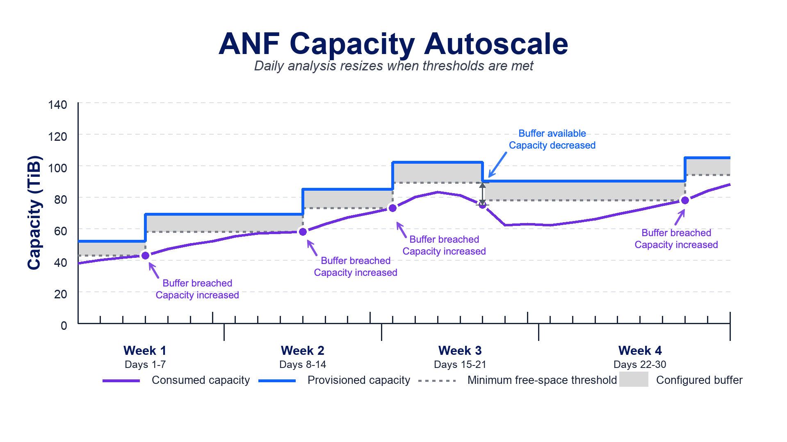
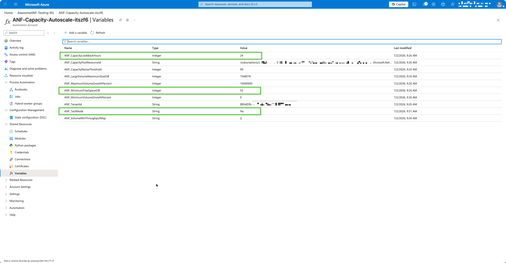
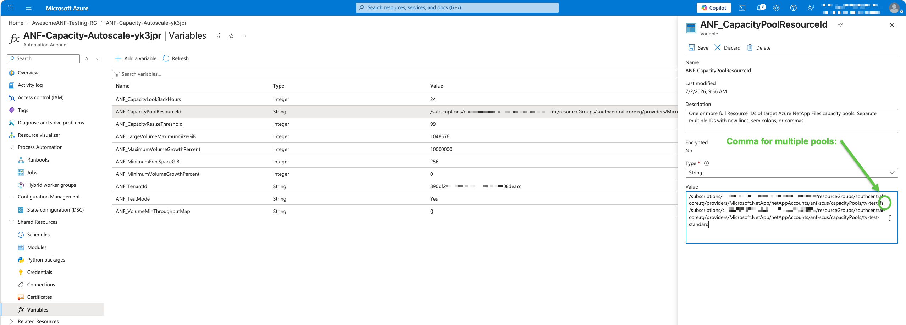

# ⚠️ Warning

**Important Notice:**

This repository is published publicly as a resource for other Azure NetApp Files (ANF) and Azure specialists. However, please be aware of the following:

1. **Unofficial Content:** Nothing in this repository is official, supported, or fully tested. This content is my own personal work and is not warranted in any way.
2. **No Endorsement:** While I work for NetApp, none of this content is officially from NetApp nor Microsoft, nor is it endorsed or supported by NetApp or Microsoft.
3. **Use at Your Own Risk:** Please use good judgment, test anything you'll run, and ensure you fully understand any code or scripts you use from this repository.

By using any content from this repository, you acknowledge that you do so at your own risk and that you are solely responsible for any consequences that may arise.

## Download Script

[ANF Capacity Autoscale](./ANF-Capacity-Autoscale.ps1)
    - Monitors volume capacity utilization and automatically adjusts volume sizes to prevent running out of space while keeping the pool size optimized for cost efficiency. Analyzes consumption trends and proactively resizes volumes when utilization thresholds are reached.

The deployment buttons create an Azure Automation Account, import the runbook on the PowerShell 7.2 runtime, create the editable `ANF_*` Automation variables, assign the managed identity `Azure NetApp Files Administrator` and `Monitoring Reader` at the target ANF account scope derived from the capacity pool Resource ID, and schedule the runbook every 4 hours. The Automation Account is deployed into the resource group selected in the portal. The RBAC assignment is deployed separately into the ANF account resource group parsed from `capacityPoolResourceId`, so the ANF account does not need to be in the same resource group as the Automation Account. The runbook only requires `Az.Accounts`; ANF resource operations and capacity metrics are handled through ARM REST APIs so it does not depend on the `Az.NetAppFiles` or `Az.Monitor` modules being present in the PowerShell 7.x runtime.

The standard ARM deployment experience still provides subscription and resource group pickers for the Automation Account deployment scope. For the ANF target, copy the capacity pool Resource ID from Azure and paste it into `capacityPoolResourceId`; the runbook derives the subscription, resource group, ANF account, and pool names from that single value.

The deployer must be allowed to deploy into the target ANF account resource group and create role assignments at the target ANF account scope, for example through Owner or User Access Administrator permissions plus deployment rights on that resource group. Without `Microsoft.Authorization/roleAssignments/write` on that target scope, the Automation Account can still be created but automatic RBAC assignment will fail.

## Capacity autoscale behavior

The runbook compares observed consumed capacity against the configured free-space buffer and adjusts provisioned capacity only when a scheduled run sees that a threshold condition has been met. When consumed capacity reaches the minimum free-space threshold, the volume and pool are expanded. When consumption has fallen far enough that capacity can be removed while preserving the configured buffer, the volume and pool can contract.

## Post-deployment variable changes

After deployment, open the Automation Account in Azure Portal and go to **Shared Resources** > **Variables**. These `ANF_*` variables are the post-install configuration surface for the runbook.

The three green-highlighted variables in the screenshot are the ones most users are likely to edit after the first deployment:

| Variable | Impact |
| --- | --- |
| `ANF_TestMode` | Deployment defaults this to `Yes`, which previews decisions and writes no pool, volume, or throughput changes. `ANF_TestMode` must be changed to `No` before the runbook applies any changes. Set it back to `Yes` when you want to preview the impact of a policy change before allowing writes again. |
| `ANF_MinimumFreeSpaceGiB` | Controls the free-space buffer. A volume expands when its free space is at or below this value, and a volume contraction target is calculated as max observed consumed size plus this value. Higher values keep more spare capacity in each volume; lower values keep volumes tighter. |
| `ANF_CapacityLookBackHours` | Controls how far back the runbook queries `VolumeLogicalSize` metrics. The script uses the maximum observed consumed size in this window. A shorter window reacts faster to recent changes; a longer window is more conservative when consumption is bursty. |

Other editable variables:

| Variable | Impact |
| --- | --- |
| `ANF_CapacityPoolResourceId` | Target pool configuration. The deployment interface still asks for one capacity pool Resource ID. After deployment, edit this variable to add more pools and separate multiple IDs with new lines, semicolons, or commas. |
| `ANF_CapacityResizeThreshold` | Percentage utilization trigger for expansion. If max observed consumed size reaches this percentage of the current volume size, the volume is considered for expansion. |
| `ANF_MinimumVolumeGrowthPercent` | Minimum percentage growth applied when a volume expands. The default `0` allows the free-space calculation to drive the target directly. |
| `ANF_MaximumVolumeGrowthPercent` | Maximum percentage growth allowed in one run. The default is intentionally very high, effectively allowing the calculated target unless you lower it. |
| `ANF_VolumeMinThroughputMap` | JSON map of volume name to minimum MiB/s. On classic Manual QoS pools it influences proportional allocation. On Flexible Service Level pools it can cause a pool throughput increase when the managed and excluded volume requirements exceed current pool throughput. |
| `ANF_LargeVolumeMaximumSizeGiB` | Maximum-size guard for existing large volumes. It defaults to 1048576 GiB (1 PiB) and can be raised after deployment in regions that support larger limits. |
| `ANF_TenantId` | Tenant used for authentication. The deploy template sets this from the deployment context; change it only if the runbook must authenticate against a different tenant. |

To manage more than one capacity pool from the same Automation Account, edit `ANF_CapacityPoolResourceId` after deployment and paste each full capacity pool Resource ID into the value. Separate multiple IDs with new lines, semicolons, or commas. Commas are often the easiest option when editing the value directly in Azure Portal.

Each capacity pool is processed independently. For every configured pool, the runbook re-reads the subscription, resource group, ANF account, pool, service level, QoS type, throughput, volume list, and volume metrics before calculating changes. There is no capacity, throughput, service-level, or volume math shared across pools. The policy variables above are shared across all pools in the same Automation Account; deploy a second Automation Account when different pools need different resize or throughput policy.

The initial deployment assigns the Automation Account managed identity to the ANF account parsed from the Resource ID entered during deployment. If you later add pool Resource IDs from other ANF accounts or subscriptions, grant that same managed identity `Azure NetApp Files Administrator` and `Monitoring Reader` on each additional target ANF account before expecting those pools to run successfully.

## Flexible Service Level behavior

- The main capacity autoscale script now detects the capacity pool service level before planning changes.
- Standard, Premium, and Ultra manual QoS pools use fixed service-level throughput rates: Standard `16`, Premium `64`, and Ultra `128` MiB/s per TiB. The available throughput is allocated proportionally to managed volumes, while respecting `ANF_VolumeMinThroughputMap`.
- Flexible Service Level pools require Manual QoS. Their capacity and throughput are planned independently: resizing the pool for capacity does not reduce or increase throughput just because the pool size changed.
- For Flexible Service Level pools, the script allocates volume throughput from the current pool throughput. It only plans a pool throughput increase when the configured per-volume minimum throughput requirements exceed the current pool throughput or the fixed 128 MiB/s floor.

## Large volume behavior

- The script reads `isLargeVolume`, `largeVolumeType`, `breakthroughMode`, and `coolAccess` from the ANF volume REST response.
- Regular volumes keep the regular volume limits and are not converted to large volumes by resize.
- Existing large volumes use the large-volume size profile automatically. There is no mode selector because volumes cannot change between regular and large by resize.
- Capacity updates still use the same volume PATCH path with `usageThreshold`; the large-volume profile changes the allowed target size envelope, not the endpoint.
- Regular volume limits are fixed at 50 GiB minimum and 102400 GiB maximum. Large volume minimum is fixed at 51200 GiB. `ANF_LargeVolumeMaximumSizeGiB` defaults to 1048576 GiB (1 PiB) and can be edited after deployment for regions that support more.
- Breakthrough large volumes are excluded from capacity and throughput changes and produce a warning when found.

## Current settings

Settings can be supplied as Azure Automation variables or as Cloud Shell/local process environment variables using the same `ANF_*` names.

| Setting | Default | Used for |
| --- | --- | --- |
| `ANF_TenantId` | placeholder | Optional tenant selection. |
| `ANF_CapacityPoolResourceId` | required | One or more target capacity pool Resource IDs. The script derives subscription, resource group, ANF account, and pool from each value. |
| `ANF_TestMode` | `Yes` | `Yes` previews only; `No` applies changes. This must be `No` before any resize or throughput updates are written. |
| `ANF_CapacityResizeThreshold` | `99` | Expands a volume when max observed utilization is at or above this percent. |
| `ANF_MinimumFreeSpaceGiB` | `256` | Expands a volume when free space is at or below this value; also sizes expansion/contraction targets. |
| `ANF_MinimumVolumeGrowthPercent` | `0` | Minimum percent growth when expanding a volume. |
| `ANF_MaximumVolumeGrowthPercent` | `10000000` | Maximum percent growth allowed in one run. |
| `ANF_CapacityLookBackHours` | `24` | Lookback window for the `VolumeLogicalSize` metric. |
| `ANF_VolumeMinThroughputMap` | empty map | JSON volume-to-minimum-throughput map, for example `{"vol1":10,"vol2":15}`. |
| `ANF_LargeVolumeMaximumSizeGiB` | `1048576` | Large volume maximum size guard. The deploy template creates this as an Automation variable but does not ask for it during setup. |

## Fixed size and throughput decisions

These values are fixed by the script unless otherwise noted.

| Decision | Default | Notes |
| --- | --- | --- |
| Regular volume minimum size | `50` GiB | Fixed. |
| Regular volume maximum size | `102400` GiB | Fixed. Regular volumes are not converted to large volumes by resize. |
| Large volume minimum size | `51200` GiB | Fixed. |
| Large volume maximum size | `1048576` GiB | Editable after deployment through `ANF_LargeVolumeMaximumSizeGiB` for regions that support more than 1 PiB. |
| Classic manual QoS rate | Standard `16`, Premium `64`, Ultra `128` MiB/s per TiB | Fixed by service level. |
| Flexible Service Level pool throughput floor | `128` MiB/s | Fixed. |
| Breakthrough large volumes | excluded | The script warns and leaves these volumes unchanged. |

## Hard-coded decisions

These values are currently fixed in the script rather than exposed as inputs.

| Decision | Value | Notes |
| --- | --- | --- |
| Default volume minimum throughput | `1` MiB/s | Used when a volume is absent from `ANF_VolumeMinThroughputMap`. |
| Volume contraction target | `MaxConsumedSizeGiB + ANF_MinimumFreeSpaceGiB` | Volumes that do not need expansion can shrink directly to this target, subject to fixed regular/large volume limits. |
| Pool sizing increment | `1024` GiB | Pool targets are rounded to whole TiB. |
| Minimum pool size | `1` TiB | Pool target is never below 1 TiB. |
| Capacity metric time grain | `01:00:00` | `VolumeLogicalSize` is queried hourly over the lookback window. |
| Missing capacity metric data | `0` consumed | Missing or empty metric data is treated as 0 GiB consumed. |

## GA Safety Notes

- Both autoscale scripts default to test mode. `ANF_TestMode` must be set to `No` before pool, volume, or throughput changes are applied.
- If `ANF_TestMode` is missing in Azure Automation, the scripts now fall back to `Yes` instead of live mode.
- Local defaults are placeholders. Set `ANF_CapacityPoolResourceId` before running against real ANF resources.
- Re-runs recalculate current capacity and throughput state before acting, so delta runs only apply changes that are still needed.
