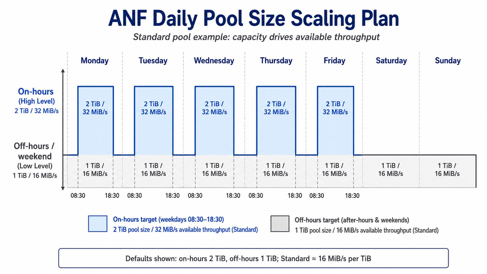

# Warning

**Important Notice:**

This repository is published publicly as a resource for other Azure NetApp Files (ANF) and Azure specialists. However, please be aware of the following:

1. **Unofficial Content:** Nothing in this repository is official, supported, or fully tested. This content is my own personal work and is not warranted in any way.
2. **No Endorsement:** While I work for NetApp, none of this content is officially from NetApp nor Microsoft, nor is it endorsed or supported by NetApp or Microsoft.
3. **Use at Your Own Risk:** Please use good judgment, test anything you'll run, and ensure you fully understand any code or scripts you use from this repository.

By using any content from this repository, you acknowledge that you do so at your own risk and that you are solely responsible for any consequences that may arise.

## Download Script

[ANF Daily Pool Size Scaling Plan](./ANF-daily-pool-size-scaling-plan.ps1)
    - Resizes a classic Azure NetApp Files capacity pool and assigns Manual QoS throughput equally across volumes for on-hours and off-hours windows.

The deployment buttons create an Azure Automation Account, import the runbook on the PowerShell 7.2 runtime, create editable `ANF_*` Automation variables, assign the managed identity `Azure NetApp Files Administrator` at the target ANF account scope derived from the capacity pool Resource ID, and schedule the runbook hourly. The Automation Account is deployed into the resource group selected in the portal. The RBAC assignment is deployed separately into the ANF account resource group parsed from `capacityPoolResourceId`, so the ANF account does not need to be in the same resource group as the Automation Account.

## When This Script Applies

This script supports Standard, Premium, and Ultra capacity pools. It does not support Flexible Service Level pools.

The script works by changing classic pool capacity. On classic service levels, available throughput is derived from capacity: Standard `16`, Premium `64`, and Ultra `128` MiB/s per TiB. Reducing the pool size reduces available throughput immediately, and the runbook then assigns the target Manual QoS throughput evenly to the volumes in that pool.

Flexible Service Level behaves differently because capacity and throughput are independent. FSL throughput decreases can be limited by a 24-hour cooldown after an increase, so this daily pool-size pattern is intentionally not used for FSL. If the runbook finds an FSL pool, it warns and leaves that pool unchanged.

This only makes sense when the classic pool is over-provisioned in capacity to reach a throughput requirement. If the pool is already sized only for provisioned volume capacity, reducing pool size may fail or may provide no useful performance-scaling behavior.

## Current Settings

Settings can be supplied as Azure Automation variables or as Cloud Shell/local process environment variables using the same `ANF_*` names.

| Setting | Default | Used for |
| --- | --- | --- |
| `ANF_TenantId` | deployment tenant | Optional tenant selection. |
| `ANF_CapacityPoolResourceId` | required | One or more target capacity pool Resource IDs. The deployment asks for one initial pool; after deployment, this Automation variable can be edited to include multiple IDs separated by new lines, semicolons, or commas. |
| `ANF_TestMode` | `Yes` | `Yes` previews only; `No` applies pool size, QoS conversion, and volume throughput changes. |
| `ANF_OnHoursTiBs` | `2` | Target pool size during the on-hours window. |
| `ANF_OffHoursTiBs` | `1` | Target pool size outside the on-hours window and on weekend days. |
| `ANF_DayStartTime` | `08:30` | Start of the on-hours window, in `HH:mm` format. |
| `ANF_DayEndTime` | `18:30` | End of the on-hours window, in `HH:mm` format. |
| `ANF_TimeZone` | `Central Standard Time` | Time zone used to evaluate the daily schedule. The script also maps common Windows IDs to IANA IDs when needed by the Automation runtime. |
| `ANF_WeekDays` | `Monday,Tuesday,Wednesday,Thursday,Friday` | Days that can use the on-hours target. |
| `ANF_WeekendDays` | `Saturday,Sunday` | Days always treated as off-hours. |

## Behavior

- The runbook detects each pool's service level before making a plan.
- Standard, Premium, and Ultra throughput rates are fixed in code and are not user inputs.
- Auto QoS pools are converted to Manual QoS in live mode because the runbook assigns explicit per-volume throughput.
- Pool expansion runs before volume throughput increases.
- Pool contraction runs after volume throughput decreases.
- The target pool size must be large enough to hold the existing provisioned volume capacity.
- Empty pools are skipped.
- Multiple configured pools are processed independently. Service level, QoS type, pool size, volume list, and throughput math are not shared across pools.

## Permissions

The deployer must be allowed to deploy into the target ANF account resource group and create role assignments at the target ANF account scope, for example through Owner or User Access Administrator permissions plus deployment rights on that resource group. Without `Microsoft.Authorization/roleAssignments/write` on that target scope, the Automation Account can still be created but automatic RBAC assignment will fail.

The initial deployment assigns RBAC only for the ANF account parsed from the Resource ID entered during deployment. If you later add pool Resource IDs from other ANF accounts or subscriptions, grant that same managed identity `Azure NetApp Files Administrator` on each additional target ANF account before expecting those pools to run successfully.

## GA Safety Notes

- The script defaults to test mode. `ANF_TestMode` must be set to `No` before live changes are applied.
- Local defaults are placeholders. Set `ANF_CapacityPoolResourceId` before running against real ANF resources.
- Re-runs inspect current pool size, QoS type, and volume throughput before acting, so repeated runs only apply changes that are still needed.
