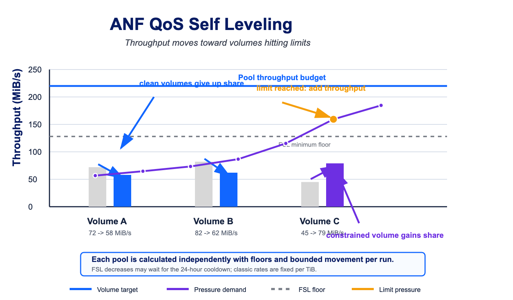

# ANF QoS Self Leveling

This script reallocates Azure NetApp Files Manual QoS volume throughput based on the `throughputLimitReached` metric. It supports Standard, Premium, Ultra, and Flexible Service Level capacity pools from one script.



## Deploy

[](https://portal.azure.com/#create/Microsoft.Template/uri/https%3A%2F%2Fraw.githubusercontent.com%2Ftvanroo%2Fpublic-anf-toolbox%2Fmain%2FANF%2520QoS%2520Self%2520Leveling%2Fdeploy%2Fazuredeploy.json)
[](https://portal.azure.us/#create/Microsoft.Template/uri/https%3A%2F%2Fraw.githubusercontent.com%2Ftvanroo%2Fpublic-anf-toolbox%2Fmain%2FANF%2520QoS%2520Self%2520Leveling%2Fdeploy%2Fazuredeploy-gov.json)

Template files:

- `ANF QoS Self Leveling/deploy/azuredeploy.json`
- `ANF QoS Self Leveling/deploy/azuredeploy-gov.json`

The deployment creates an Azure Automation Account, imports the PowerShell 7.2 runbook, installs `Az.Accounts`, creates the runbook schedule, and grants the managed identity Azure NetApp Files Administrator plus Monitoring Reader on the ANF account that owns the initial target pool.

If you add capacity pools from other ANF accounts after deployment, grant the same managed identity permissions on each additional ANF account.

## Behavior

Each capacity pool is processed independently. Service level, QoS mode, current throughput, volume metrics, and all allocation math are evaluated per pool with no cross-pool assumptions.

Classic service levels use fixed pool throughput rates:

- Standard: 16 MiB/s per TiB
- Premium: 64 MiB/s per TiB
- Ultra: 128 MiB/s per TiB

The planner reserves throughput currently assigned to excluded volumes before calculating managed-volume targets. Excluded volumes are never changed by this runbook.

Managed volumes consume the full remaining throughput budget for the pool. If metric pressure only requires a small amount of throughput, the unused budget is still redistributed across managed volumes instead of being left idle.

If planned managed-volume throughput plus excluded-volume reservations exceeds the current pool budget, the runbook expands the pool budget before increasing volume throughput. Standard, Premium, and Ultra pools are expanded by increasing capacity to the next whole TiB required by the service-level throughput rate. FSL uses the current manual pool throughput as the starting budget and is expanded by increasing purchased pool throughput when needed. FSL pool throughput decreases are attempted after volume decreases, but Azure NetApp Files can enforce a 24-hour cooldown after an FSL throughput increase, so a decrease may be deferred even when volume-level changes complete.

Auto QoS classic pools can be converted to Manual QoS when `ANF_ConvertToManualMode` is `Yes`. In test mode, conversion and throughput changes are only reported.

## Post-Deployment Variables

Edit variables in **Automation Account > Shared Resources > Variables**.

| Variable | Default | Impact |
| --- | --- | --- |
| `ANF_CapacityPoolResourceId` | required | One or more full capacity pool Resource IDs. Separate multiple IDs with new lines, semicolons, or commas. |
| `ANF_TestMode` | `Yes` | `Yes` previews work only. Change to `No` before expecting live throughput or QoS changes. |
| `ANF_TenantId` | tenant from deployment | Tenant used for managed identity or device authentication context. |
| `ANF_ConvertToManualMode` | `Yes` | Allows classic Standard/Premium/Ultra Auto QoS pools to be converted to Manual QoS. FSL already requires Manual QoS. |
| `ANF_MinimumThroughputPerVolume` | `1` | Per-volume throughput floor in MiB/s. |
| `ANF_ThroughputLookBackHours` | `24` | Lookback window for `throughputLimitReached` pressure. |
| `ANF_DecreaseRequiredCleanDays` | `3` | Number of clean trailing 24-hour windows required before a volume throughput decrease is allowed. |
| `ANF_LevelingAgressionPercent` | `10` | Percent of movable throughput shifted per run. The spelling preserves the original script variable name. |
| `ANF_ThroughputLimitMetricAllowance` | `0` | Maximum acceptable average `throughputLimitReached` value before a volume is considered constrained. |
| `ANF_ExcludeTagKey` | `ExcludeFromAnfQosSelfLeveling` | Tag key used to exclude volumes. |
| `ANF_ExcludeTagValue` | `true` | Tag value used with `ANF_ExcludeTagKey`. |

## Multiple Pools

`ANF_CapacityPoolResourceId` accepts multiple pool IDs without changing the deployment interface:

```text
/subscriptions/<sub>/resourceGroups/<rg>/providers/Microsoft.NetApp/netAppAccounts/<account>/capacityPools/<pool-a>
/subscriptions/<sub>/resourceGroups/<rg>/providers/Microsoft.NetApp/netAppAccounts/<account>/capacityPools/<pool-b>
```

Commas and semicolons are also accepted. Shared tuning variables are reused across all configured pools; deploy a separate Automation Account if different pools need different thresholds or aggressiveness.

## Manual Run

From Cloud Shell or any PowerShell session with `Az.Accounts`:

```powershell
$env:ANF_TenantId = "<tenant-id>"
$env:ANF_CapacityPoolResourceId = "/subscriptions/<sub>/resourceGroups/<rg>/providers/Microsoft.NetApp/netAppAccounts/<account>/capacityPools/<pool>"
$env:ANF_TestMode = "Yes"
pwsh ./ANF-QoS-Autoscale-SelfLeveling.ps1
```

Review the table output first. Set `ANF_TestMode` to `No` only after the planned changes match expectations.

## Notes

- Volumes tagged with `ExcludeFromAnfQosSelfLeveling=true` are ignored and their throughput remains reserved from the managed budget.
- If all volumes are excluded or a pool has no volumes, that pool is skipped.
- Unused managed throughput is redistributed to managed volumes proportionally, with metric pressure taking precedence when `throughputLimitReached` is present.
- If volume throughput targets exceed available pool throughput, the script increases classic pool capacity or FSL purchased throughput before applying volume increases.
- Decreases require clean metric windows to avoid reducing throughput immediately after transient pressure clears.
- The script uses ARM REST calls so it can run in the PowerShell 7.2 Automation runtime without ANF-specific or monitoring cmdlet modules.
