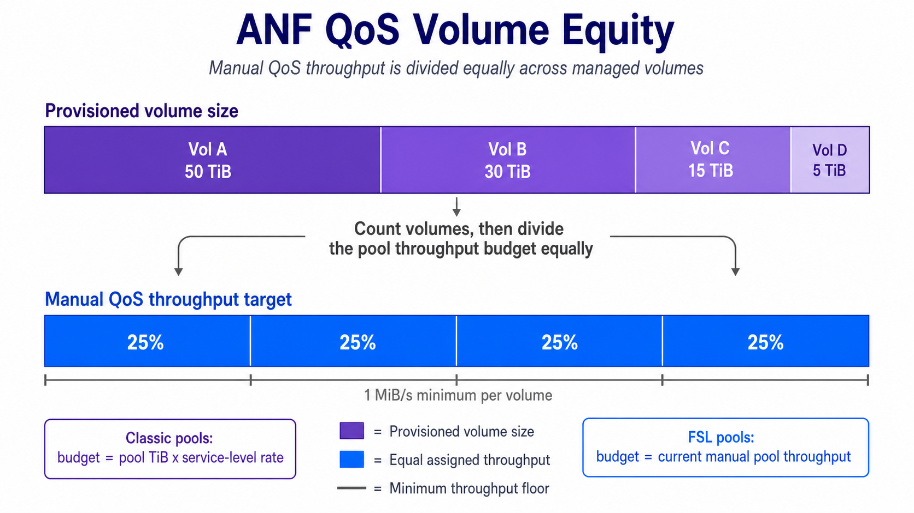

# Warning

**Important Notice:**

This repository is published publicly as a resource for other Azure NetApp Files (ANF) and Azure specialists. However, please be aware of the following:

1. **Unofficial Content:** Nothing in this repository is official, supported, or fully tested. This content is my own personal work and is not warranted in any way.
2. **No Endorsement:** While I work for NetApp, none of this content is officially from NetApp nor Microsoft, nor is it endorsed or supported by NetApp or Microsoft.
3. **Use at Your Own Risk:** Please use good judgment, test anything you'll run, and ensure you fully understand any code or scripts you use from this repository.

By using any content from this repository, you acknowledge that you do so at your own risk and that you are solely responsible for any consequences that may arise.

## Download Script

[ANF QoS Volume Equity](./ANF-QoS-Autoscale-VolumeEquity.ps1)
    - Assigns Manual QoS volume throughput equally across all volumes in each configured capacity pool.

The deployment buttons create an Azure Automation Account, import the runbook on the PowerShell 7.2 runtime, create editable `ANF_*` Automation variables, assign the managed identity `Azure NetApp Files Administrator` at the target ANF account scope derived from the capacity pool Resource ID, and schedule the runbook hourly. The Automation Account is deployed into the resource group selected in the portal. The RBAC assignment is deployed separately into the ANF account resource group parsed from `capacityPoolResourceId`, so the ANF account does not need to be in the same resource group as the Automation Account.

The runbook only requires `Az.Accounts`. ANF resource reads and writes are handled through ARM REST APIs so the runbook can run on the PowerShell 7.2 Automation runtime without depending on older ANF-specific modules.

The standard ARM deployment experience still provides subscription and resource group pickers for the Automation Account deployment scope. For the ANF target, copy the capacity pool Resource ID from Azure and paste it into `capacityPoolResourceId`; the runbook derives the subscription, resource group, ANF account, and pool names from that single value.

## When This Script Applies

This script supports Standard, Premium, Ultra, and Flexible Service Level capacity pools.

The runbook calculates a per-pool throughput budget, assigns each volume a configurable minimum throughput floor, and then gives each managed volume an equal share of the pool throughput budget. The result is a Manual QoS allocation where performance is governed by volume count rather than volume size or historical usage.

For Standard, Premium, and Ultra pools, available pool throughput is derived from pool capacity using the fixed service-level rates: Standard `16`, Premium `64`, and Ultra `128` MiB/s per TiB.

For Flexible Service Level pools, capacity and throughput are independent. FSL uses the current manual pool throughput as the volume-equity budget. This script does not purchase, increase, or decrease FSL pool throughput; it only allocates the throughput currently available on the pool across the volumes.

## Current Settings

Settings can be supplied as Azure Automation variables or as Cloud Shell/local process environment variables using the same `ANF_*` names.

| Setting | Default | Used for |
| --- | --- | --- |
| `ANF_TenantId` | deployment tenant | Optional tenant selection. |
| `ANF_CapacityPoolResourceId` | required | One or more target capacity pool Resource IDs. The deployment asks for one initial pool; after deployment, this Automation variable can be edited to include multiple IDs separated by new lines, semicolons, or commas. |
| `ANF_TestMode` | `Yes` | `Yes` previews only; `No` applies QoS conversion and volume throughput updates. This must be `No` before any live changes are written. |
| `ANF_MinimumThroughputPerVolume` | `1` | Minimum throughput floor in MiB/s required for every managed volume. If the equal-share target would be lower than this value, the runbook stops for that pool. |
| `ANF_ConvertToManualMode` | `Yes` | For classic Standard, Premium, and Ultra pools, `Yes` converts Auto QoS pools to Manual QoS before applying explicit volume throughput. In test mode, the conversion is only reported. |

## Behavior

- The runbook detects each pool's service level and QoS type before making a plan.
- Standard, Premium, and Ultra throughput rates are fixed in code and are not user inputs.
- Flexible Service Level pools must already use Manual QoS because FSL does not support Auto QoS.
- Classic Auto QoS pools are converted to Manual QoS in live mode when `ANF_ConvertToManualMode` is `Yes`.
- Each managed volume receives the same whole-MiB/s throughput target, except for any one-MiB rounding remainder needed to allocate the full budget.
- Decreases are applied before increases so throughput is freed before being reassigned elsewhere in the same pool.
- Empty pools are skipped.
- Re-runs inspect current pool and volume throughput before acting, so repeated runs only apply changes that are still needed.

## Multiple Pools

To manage more than one capacity pool from the same Automation Account, edit `ANF_CapacityPoolResourceId` after deployment and paste each full capacity pool Resource ID into the value. Separate multiple IDs with new lines, semicolons, or commas. Commas are often the easiest option when editing the value directly in Azure Portal.

Each capacity pool is processed independently. For every configured pool, the runbook re-reads the subscription, resource group, ANF account, pool, service level, QoS type, current pool throughput, volume list, and current volume throughput before calculating changes. There is no capacity, throughput, service-level, or volume math shared across pools.

The policy variables above are shared across all pools in the same Automation Account. Deploy a second Automation Account when different pools need different minimum throughput or conversion policy.

The initial deployment assigns the Automation Account managed identity to the ANF account parsed from the Resource ID entered during deployment. If you later add pool Resource IDs from other ANF accounts or subscriptions, grant that same managed identity `Azure NetApp Files Administrator` on each additional target ANF account before expecting those pools to run successfully.

## Permissions

The deployer must be allowed to deploy into the target ANF account resource group and create role assignments at the target ANF account scope, for example through Owner or User Access Administrator permissions plus deployment rights on that resource group. Without `Microsoft.Authorization/roleAssignments/write` on that target scope, the Automation Account can still be created but automatic RBAC assignment will fail.

## GA Safety Notes

- The script defaults to test mode. `ANF_TestMode` must be set to `No` before QoS conversion or volume throughput changes are applied.
- Local defaults are placeholders. Set `ANF_CapacityPoolResourceId` before running against real ANF resources.
- FSL pool throughput changes are intentionally out of scope for this script. Change the pool throughput separately when the pool needs a larger or smaller FSL throughput budget.
