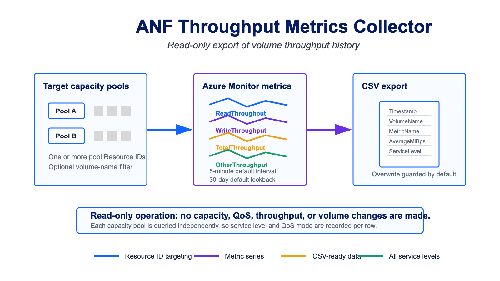

# ANF Throughput Metrics Collector

This read-only script exports historical Azure NetApp Files volume throughput metrics to CSV. It supports Standard, Premium, Ultra, and Flexible Service Level capacity pools because it reads Azure Monitor metrics from each target volume and does not depend on service-level-specific throughput calculations.



## Cloud Shell / PowerShell Quick Start

Copy this block as-is into Azure Cloud Shell PowerShell or a local PowerShell session. It downloads and prepares the script from the current WIP branch, then discovers ANF volumes in the selected subscription.

```powershell
$RepoRef = "codex/throughput-metrics-modernization"
$ScriptName = "ANF-throughput-metrics-collector.ps1"
$DownloadStamp = (Get-Date).ToUniversalTime().ToString("yyyyMMdd-HHmmssZ")
$ScriptPath = Join-Path (Get-Location) "ANF-throughput-metrics-collector-$DownloadStamp.ps1"
$ScriptUrl = "https://raw.githubusercontent.com/tvanroo/public-anf-toolbox/$RepoRef/ANF%20Throughput%20Metrics%20Collector/$ScriptName`?cacheBust=$DownloadStamp"

# Optional filters. Leave these commented to collect every discovered ANF volume.
# $env:ANF_SubscriptionId = "<subscription-id-or-name>"
# $env:ANF_AccountNameFilter = "prod"
# $env:ANF_PoolNameFilter = "premium"
# $env:ANF_VolumeNameFilter = "avd"

# Optional collection settings.
# $env:ANF_LookBackDays = "30"
# $env:ANF_TimeGrainMinutes = "5"

# Download and prep the script.
$ProgressPreference = "SilentlyContinue"
Invoke-WebRequest -Uri $ScriptUrl -OutFile $ScriptPath
$isWindowsPowerShellHost = $true
$isWindowsVariable = Get-Variable -Name IsWindows -ErrorAction SilentlyContinue
if ($isWindowsVariable) {
    $isWindowsPowerShellHost = [bool]$isWindowsVariable.Value
}
if ($isWindowsPowerShellHost -and (Get-Command Unblock-File -ErrorAction SilentlyContinue)) {
    Unblock-File -Path $ScriptPath
}

# Run the downloaded collector.
& $ScriptPath
```

After the script is downloaded, you can change only the `ANF_*` environment variables and rerun the local copy:

```powershell
& ./ANF-throughput-metrics-collector.ps1
```

## What It Collects

- `ReadThroughput`
- `WriteThroughput`
- `TotalThroughput`
- `OtherThroughput`
- `throughputLimitReached`

Throughput metrics are exported in bytes per second and MiB/s. `throughputLimitReached` is exported as its average metric value and is not converted to MiB/s.

Each capacity pool is queried independently. The script discovers capacity pools across visible Azure subscriptions by default and does not modify pools, volumes, QoS settings, capacity, or throughput.

## Inputs

Set these as environment variables before running from Cloud Shell or a local PowerShell session. Azure Automation variables with the same names are also supported if you choose to run it there.

| Variable | Default | Impact |
| --- | --- | --- |
| `ANF_TenantId` | current context | Optional tenant ID used when authentication needs to switch tenants. |
| `ANF_SubscriptionId` | prompt when multiple exist | Optional subscription ID or exact subscription name used for discovery. If omitted and multiple active subscriptions are visible, local runs prompt for one. |
| `ANF_CapacityPoolResourceId` | discover visible pools | Optional explicit target override with one or more full capacity pool Resource IDs. Separate multiple IDs with new lines, semicolons, or commas. |
| `ANF_AccountNameFilter` | all accounts | Optional account name text filter. Multiple values can be separated with new lines, semicolons, or commas. |
| `ANF_PoolNameFilter` | all pools | Optional capacity pool name text filter. Multiple values can be separated with new lines, semicolons, or commas. |
| `ANF_VolumeNameFilter` | all volumes | Optional volume name text filter. Multiple values can be separated with new lines, semicolons, or commas. |
| `ANF_LookBackDays` | `30` | Number of trailing days to request from Azure Monitor. |
| `ANF_TimeGrainMinutes` | `5` | Metric interval in minutes. |
| `ANF_OutputPath` | `./ANF-throughput-metrics-<timestamp>.csv` | CSV output path. The default includes a UTC timestamp such as `20260716-214530Z`. |
| `ANF_OverwriteOutput` | `No` | `No` protects an existing output file. The timestamped default normally avoids collisions. Set to `Yes` only when intentionally reusing an output path. |

## Optional Narrowing Examples

```powershell
$env:ANF_AccountNameFilter = "prod"
$env:ANF_PoolNameFilter = "premium"
$env:ANF_VolumeNameFilter = "avd"
& ./ANF-throughput-metrics-collector.ps1
```

To bypass discovery and target specific pools:

```powershell
$env:ANF_CapacityPoolResourceId = @"
/subscriptions/<sub>/resourceGroups/<rg>/providers/Microsoft.NetApp/netAppAccounts/<account>/capacityPools/<pool-a>
/subscriptions/<sub>/resourceGroups/<rg>/providers/Microsoft.NetApp/netAppAccounts/<account>/capacityPools/<pool-b>
"@
```

## Output Columns

- `Timestamp`
- `SubscriptionId`
- `ResourceGroup`
- `ANFAccount`
- `ANFPool`
- `ServiceLevel`
- `QoSType`
- `VolumeName`
- `VolumeId`
- `MetricName`
- `MetricUnit`
- `AverageValue`
- `AverageBytesPerSecond`
- `AverageMiBps`
- `TimeGrainMinutes`

## Permissions

The authenticated identity needs read access to the ANF account and Azure Monitor metrics access for the target volumes. Monitoring Reader on the ANF account scope is the intended least-surprise permission for metric reads.

## Notes

- New or inactive volumes may have fewer data points than the requested lookback window.
- Large lookback windows and small intervals can produce large CSV files.
- The script uses ARM REST calls and only requires `Az.Accounts`.
