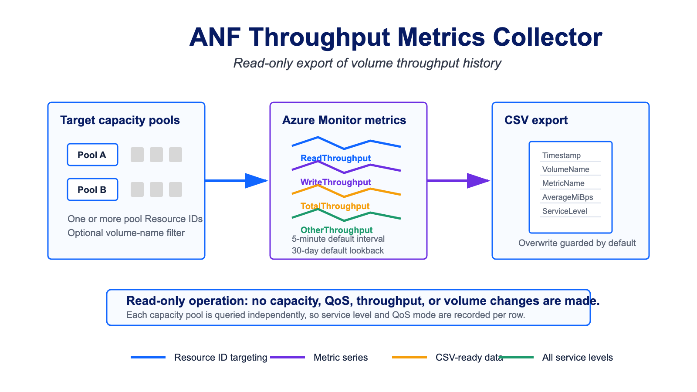

# ANF Throughput Metrics Collector

This read-only script exports historical Azure NetApp Files volume throughput and capacity metrics to CSV. It supports Standard, Premium, Ultra, and Flexible Service Level capacity pools because it reads Azure Monitor metrics from each target volume and does not depend on service-level-specific throughput calculations.



## Cloud Shell / PowerShell Quick Start

Copy this block as-is into Azure Cloud Shell PowerShell or a local PowerShell session. It downloads and prepares the current script from GitHub, then discovers ANF volumes in the selected subscription(s) in one tenant.

```powershell
$RepoRef = "main"
$ScriptName = "ANF-throughput-metrics-collector.ps1"
$DownloadStamp = (Get-Date).ToUniversalTime().ToString("yyyyMMdd-HHmmssZ")
$ScriptPath = Join-Path (Get-Location) $ScriptName
$ScriptUrl = "https://raw.githubusercontent.com/tvanroo/public-anf-toolbox/$RepoRef/ANF%20Throughput%20Metrics%20Collector/$ScriptName`?cacheBust=$DownloadStamp"

# Optional filters. Leave these commented to collect every discovered ANF volume.
# $env:ANF_SubscriptionId = "<subscription-id-1>;<subscription-id-2>" # or "All"
# $env:ANF_AccountNameFilter = "prod"
# $env:ANF_PoolNameFilter = "premium"
# $env:ANF_VolumeNameFilter = "avd"

# Optional collection settings.
# $env:ANF_LookBackDays = "30"
# $env:ANF_TimeGrainMinutes = "5"

# Download and prep the script.
$ProgressPreference = "SilentlyContinue"
Invoke-WebRequest -Uri $ScriptUrl -OutFile $ScriptPath
$isWindowsPowerShellHost = $true
$isWindowsVariable = Get-Variable -Name IsWindows -ErrorAction SilentlyContinue
if ($isWindowsVariable) {
    $isWindowsPowerShellHost = [bool]$isWindowsVariable.Value
}
if ($isWindowsPowerShellHost -and (Get-Command Unblock-File -ErrorAction SilentlyContinue)) {
    Unblock-File -Path $ScriptPath
}

# Run the downloaded collector.
& $ScriptPath
```

After the script is downloaded, you can change only the `ANF_*` environment variables and rerun the local copy:

```powershell
& ./ANF-throughput-metrics-collector.ps1
```

## What It Collects

- `ReadThroughput`
- `WriteThroughput`
- `TotalThroughput`
- `OtherThroughput`
- `throughputLimitReached`
- `VolumeAllocatedSize` (historical provisioned capacity)
- `VolumeLogicalSize` (historical used bytes)

Throughput metrics are exported in bytes per second and MiB/s. `throughputLimitReached` is exported as its average metric value and is not converted to MiB/s.

Capacity metrics use bytes and GiB (1 GiB = 1,073,741,824 bytes). Used capacity follows Azure Monitor’s `VolumeLogicalSize` definition, including active filesystem data and snapshots; it is not a client filesystem free-space reading. See [Microsoft’s capacity explanation](https://learn.microsoft.com/en-us/azure/azure-netapp-files/azure-netapp-files-metrics). See [Microsoft’s metric definitions](https://learn.microsoft.com/en-us/azure/azure-monitor/reference/supported-metrics/microsoft-netapp-netappaccounts-capacitypools-volumes-metrics).

Each capacity pool is queried independently. The script discovers capacity pools across the selected subscriptions in the authenticated tenant and does not modify pools, volumes, QoS settings, capacity, or throughput.

## Inputs

Set these as environment variables before running from Cloud Shell or a local PowerShell session. Azure Automation variables with the same names are also supported if you choose to run it there.

| Variable | Default | Impact |
| --- | --- | --- |
| `ANF_TenantId` | current context | Tenant boundary for discovery and explicit pool targets. Defaults to the authenticated context tenant. |
| `ANF_SubscriptionId` | prompt when multiple exist | One or more subscription IDs or exact names, separated by new lines, semicolons, or commas. Use `All` for every active subscription in the tenant. Local runs accept multiple menu numbers or `All`. Automation defaults to the current subscription; set this explicitly for multiple subscriptions. Unknown or ambiguous selections fail. |
| `ANF_CapacityPoolResourceId` | discover visible pools | Optional explicit target override with one or more full capacity pool Resource IDs. Separate multiple IDs with new lines, semicolons, or commas. IDs may span subscriptions in the same tenant; this overrides subscription discovery. |
| `ANF_AccountNameFilter` | all accounts | Optional account name text filter. Multiple values can be separated with new lines, semicolons, or commas. |
| `ANF_PoolNameFilter` | all pools | Optional capacity pool name text filter. Multiple values can be separated with new lines, semicolons, or commas. |
| `ANF_VolumeNameFilter` | all volumes | Optional volume name text filter. Multiple values can be separated with new lines, semicolons, or commas. |
| `ANF_LookBackDays` | `30` | Number of trailing days to request from Azure Monitor. |
| `ANF_TimeGrainMinutes` | `5` | Metric interval in minutes. |
| `ANF_OutputPath` | `./ANF-throughput-metrics-<timestamp>.csv` | CSV output path. The default includes a UTC timestamp such as `20260716-214530Z`. |
| `ANF_OverwriteOutput` | `No` | `No` protects an existing output file. The timestamped default normally avoids collisions. Set to `Yes` only when intentionally reusing an output path. |

## Optional Narrowing Examples

```powershell
$env:ANF_AccountNameFilter = "prod"
$env:ANF_PoolNameFilter = "premium"
$env:ANF_VolumeNameFilter = "avd"
& ./ANF-throughput-metrics-collector.ps1
```

To collect every volume in specific pools (including pools in different subscriptions of the same tenant):

```powershell
$env:ANF_CapacityPoolResourceId = @"
/subscriptions/<sub-1>/resourceGroups/<rg>/providers/Microsoft.NetApp/netAppAccounts/<account>/capacityPools/<pool-a>
/subscriptions/<sub-2>/resourceGroups/<rg>/providers/Microsoft.NetApp/netAppAccounts/<account>/capacityPools/<pool-b>
"@
# Clear any filters left from earlier runs to include every volume in these pools.
Remove-Item Env:ANF_AccountNameFilter, Env:ANF_PoolNameFilter, Env:ANF_VolumeNameFilter, Env:ANF_VolumeName -ErrorAction SilentlyContinue
& ./ANF-throughput-metrics-collector.ps1
```

To discover pools across several subscriptions instead:

```powershell
Remove-Item Env:ANF_CapacityPoolResourceId -ErrorAction SilentlyContinue
$env:ANF_TenantId = "<tenant-id>"
$env:ANF_SubscriptionId = "<subscription-id-1>;<subscription-id-2>" # or "All"
& ./ANF-throughput-metrics-collector.ps1
```

## Output Columns

- `Timestamp`
- `SubscriptionId`
- `ResourceGroup`
- `ANFAccount`
- `ANFPool`
- `ServiceLevel`
- `QoSType`
- `VolumeName`
- `VolumeId`
- `MetricName`
- `MetricUnit`
- `AverageValue`
- `AverageBytesPerSecond`
- `AverageMiBps`
- `AverageBytes` (capacity metrics only)
- `AverageGiB` (capacity metrics only)
- `TimeGrainMinutes`

The metrics CSV retains one row per metric and timestamp. A companion `<output-name>.volumes.csv` contains one row for every enumerated volume that passes the optional filters, even when metrics are missing or fail:

- Resource identity and pool service level / QoS.
- `CollectedAtUtc`, `AllocatedBytes`, `AllocatedGiB`: current configured quota from the volume resource (`usageThreshold`), not a historical value.
- `UsedBytes`, `UsedGiB`, `UsedMetricTimestamp`: latest non-null `VolumeLogicalSize` interval average within the requested window. It may be older than collection time; missing data stays blank, and a measured zero stays zero.
- `MetricsStatus` (`Collected`, `NoData`, `PartialFailure`, or `Failed`) and `MetricsError`. `Collected` means some metric data exists; used capacity can still be missing.

Both files honor the overwrite guard. Available results are exported before reporting pool or metric failures. If there are no metric samples, only the volume summary is written. Pools that cannot be enumerated cannot contribute volume rows; their failures are reported.

## Permissions

The authenticated identity needs read access to the ANF account and Azure Monitor metrics access for the target volumes. Monitoring Reader on the ANF account scope is the intended least-surprise permission for metric reads.

## Notes

- New or inactive volumes may have fewer data points than the requested lookback window.
- Large lookback windows and small intervals can produce large CSV files.
- The script uses ARM REST calls and only requires `Az.Accounts`.
