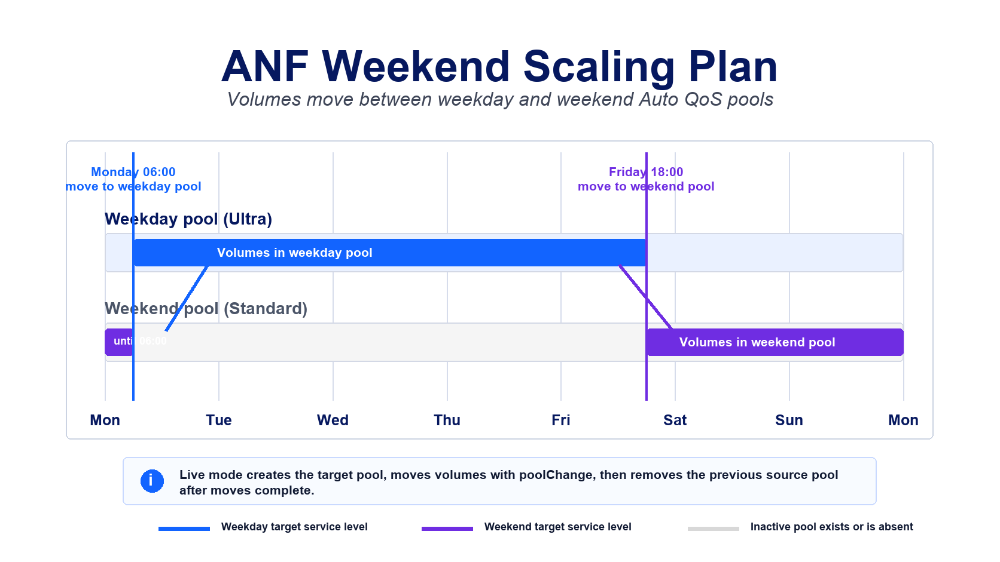

# Warning

**Important Notice:**

This repository is published publicly as a resource for other Azure NetApp Files (ANF) and Azure specialists. However, please be aware of the following:

1. **Unofficial Content:** Nothing in this repository is official, supported, or fully tested. This content is my own personal work and is not warranted in any way.
2. **No Endorsement:** While I work for NetApp, none of this content is officially from NetApp nor Microsoft, nor is it endorsed or supported by NetApp or Microsoft.
3. **Use at Your Own Risk:** Please use good judgment, test anything you'll run, and ensure you fully understand any code or scripts you use from this repository.

By using any content from this repository, you acknowledge that you do so at your own risk and that you are solely responsible for any consequences that may arise.

## WIP Download And Deployment

This modernization is on the `codex/weekend-scaling-modernization` branch for testing.

[ANF Weekend Scaling Plan](./anf-weekend-scaling-plan.ps1)
    - Moves volumes between weekday and weekend pools to shift classic service levels for scheduled cost savings.

The deployment buttons create an Azure Automation Account, import the runbook on the PowerShell 7.2 runtime, create editable `ANF_*` Automation variables, assign the managed identity `Azure NetApp Files Administrator` at the target ANF account scope derived from the initial capacity pool Resource ID, and schedule the runbook hourly. The Automation Account is deployed into the resource group selected in the portal. The RBAC assignment is deployed separately into the ANF account resource group parsed from `capacityPoolResourceId`, so the ANF account does not need to be in the same resource group as the Automation Account.

The runbook only requires `Az.Accounts`. ANF resource reads, pool creation, volume pool moves, and pool deletion are handled through ARM REST APIs so the runbook can run on the PowerShell 7.2 Automation runtime without depending on older ANF-specific modules.

## When This Script Applies

This script supports Standard, Premium, and Ultra capacity pools with either Auto QoS or Manual QoS.

The script is intended for environments that want to move volumes into a lower-cost classic service level over the weekend and back to a higher-performance classic service level for weekdays. It creates the missing target pool by copying the active pool's size and core pool settings, changes the service level to the configured weekday or weekend value, moves volumes with the ANF `poolChange` REST action, and removes the previous source pool after the move requests complete.

Flexible Service Level is intentionally excluded. FSL throughput is independent from capacity and throughput decreases can be limited by a 24-hour cooldown after an increase, which does not match this pool-move weekend schedule.

Auto QoS pools are moved without per-volume throughput changes because ANF allocates the pool throughput automatically.

Manual QoS pools are moved as Manual QoS pools. Before moving into a lower-throughput target, the runbook reduces volume `throughputMibps` where needed so the volumes fit within the target pool's service-level throughput budget. After moving into a higher-throughput target, it increases volume `throughputMibps` where needed. The allocation is a simple mimic-auto model: target pool throughput is calculated from the target service level and pool size, then distributed across the volumes in proportion to their provisioned capacity with a 1 MiB/s per-volume floor.

## Current Settings

Settings can be supplied as Azure Automation variables or as Cloud Shell/local process environment variables using the same `ANF_*` names.

| Setting | Default | Used for |
| --- | --- | --- |
| `ANF_TenantId` | deployment tenant | Optional tenant selection. |
| `ANF_CapacityPoolResourceId` | required | One or more initial capacity pool Resource IDs. The initial pool may be removed after the first successful move; the Resource ID still identifies the subscription, resource group, ANF account, and initial pool name for the managed pool set. Multiple IDs can be separated by new lines, semicolons, or commas. |
| `ANF_TestMode` | `Yes` | `Yes` previews only; `No` creates the target pool, moves volumes, and removes the previous source pool. This must be `No` before any live changes are written. |
| `ANF_WeekdayServiceLevel` | `Ultra` | Classic service level for the weekday pool. |
| `ANF_WeekendServiceLevel` | `Standard` | Classic service level for the weekend pool. |
| `ANF_WeekendStartDay` | `Friday` | Day when the weekend window begins. |
| `ANF_WeekendStartTime` | `18:00` | Time when the weekend window begins, in `HH:mm` format. |
| `ANF_WeekendFullDays` | `Saturday,Sunday` | Comma-separated days that are entirely treated as weekend. |
| `ANF_WeekendEndDay` | `Monday` | Day when the weekend window ends. |
| `ANF_WeekendEndTime` | `06:00` | Time when the weekend window ends, in `HH:mm` format. |
| `ANF_TimeZone` | `Central Standard Time` | Time zone used by the runbook to evaluate the schedule. |

Weekday and weekend pool names are derived automatically from the initial pool name parsed from `ANF_CapacityPoolResourceId`: `<initial-pool>-weekday` and `<initial-pool>-weekend`. The deployment workflow does not ask for pool names because this script manages the full pool set rather than individual volume targets.

## Time Zone Format

`ANF_TimeZone` must be a .NET `TimeZoneInfo` time zone ID string. The Deploy to Azure and Deploy to Azure Gov templates expose this as a dropdown of common Windows time zone IDs. For Azure Automation, use the Windows time zone ID format, not a UTC offset, abbreviation, or display label.

Do use values like `Central Standard Time`, `GMT Standard Time`, or `Tokyo Standard Time`.

Do not use values like `CST`, `CDT`, `UTC-06:00`, `America/Chicago`, or `(UTC-06:00) Central Time (US & Canada)` for the Automation variable.

The word `Standard` in Windows time zone IDs does not mean daylight saving time is ignored. For example, `Pacific Standard Time` represents Pacific Time and follows the daylight saving rules for that time zone when applicable.

If your required Windows time zone ID is not in the deployment dropdown, leave the script in `ANF_TestMode=Yes`, deploy with any listed value, then edit the `ANF_TimeZone` Automation variable before setting `ANF_TestMode` to `No`.

For the complete Microsoft-maintained reference list, see [Default Time Zones](https://learn.microsoft.com/en-us/windows-hardware/manufacture/desktop/default-time-zones?view=windows-11). On a Windows machine, `tzutil /l` also returns the current local list of available Windows time zone IDs.

Common examples:

| Region | Example `ANF_TimeZone` value |
| --- | --- |
| UTC | `UTC` |
| US Pacific | `Pacific Standard Time` |
| US Mountain | `Mountain Standard Time` |
| US Central | `Central Standard Time` |
| US Eastern | `Eastern Standard Time` |
| United Kingdom, Ireland, Portugal | `GMT Standard Time` |
| Central Europe | `W. Europe Standard Time` |
| France, Spain, Belgium, Denmark | `Romance Standard Time` |
| South Africa | `South Africa Standard Time` |
| UAE, Oman | `Arabian Standard Time` |
| India | `India Standard Time` |
| Singapore, Malaysia | `Singapore Standard Time` |
| China | `China Standard Time` |
| Japan | `Tokyo Standard Time` |
| Korea | `Korea Standard Time` |
| Eastern Australia | `AUS Eastern Standard Time` |
| New Zealand | `New Zealand Standard Time` |

## Behavior

- The runbook detects whether the current localized time is inside the weekend window.
- The active pool is whichever one of the initial, weekday, or weekend pools currently contains volumes.
- If more than one managed pool currently contains volumes, the runbook stops to avoid ambiguous moves.
- If no volumes are found in the initial, weekday, or weekend pools, the runbook exits with a clear error instead of looping.
- If the active pool already matches the schedule, no pool creation, move, or deletion is attempted.
- In live mode, the target pool is created first when it does not already exist.
- Target pools are created with the same QoS type as the active source pool.
- Volumes are moved with the ANF `poolChange` REST action.
- Manual QoS volume throughput decreases are applied before the move, and increases are applied after the volumes are visible in the target pool.
- The previous source pool is removed only after the volume move requests complete.
- Flexible Service Level pools are rejected before changes are planned.

## Multiple Pool Sets

To manage more than one initial pool set from the same Automation Account, edit `ANF_CapacityPoolResourceId` after deployment and paste each full initial capacity pool Resource ID into the value. Separate multiple IDs with new lines, semicolons, or commas.

Each configured pool set is processed independently. For every configured initial pool Resource ID, the runbook re-reads the subscription, resource group, ANF account, initial pool, weekday pool, weekend pool, volume placement, service levels, and QoS type before calculating changes. There is no pool state, volume placement, or schedule math shared across pool sets.

The policy variables above are shared across all pool sets in the same Automation Account. Deploy a second Automation Account when different pool sets need different target service levels or weekend windows.

The initial deployment assigns the Automation Account managed identity to the ANF account parsed from the Resource ID entered during deployment. If you later add pool Resource IDs from other ANF accounts or subscriptions, grant that same managed identity `Azure NetApp Files Administrator` on each additional target ANF account before expecting those pool sets to run successfully.

## Permissions

The deployer must be allowed to deploy into the target ANF account resource group and create role assignments at the target ANF account scope, for example through Owner or User Access Administrator permissions plus deployment rights on that resource group. Without `Microsoft.Authorization/roleAssignments/write` on that target scope, the Automation Account can still be created but automatic RBAC assignment will fail.

## GA Safety Notes

- The script defaults to test mode. `ANF_TestMode` must be set to `No` before any pool creation, volume move, or pool removal is attempted.
- Start with one pool set and confirm test-mode output before enabling live mode.
- Leave enough time for ANF volume pool changes to complete before assuming all moved volumes are available in the target service level.
