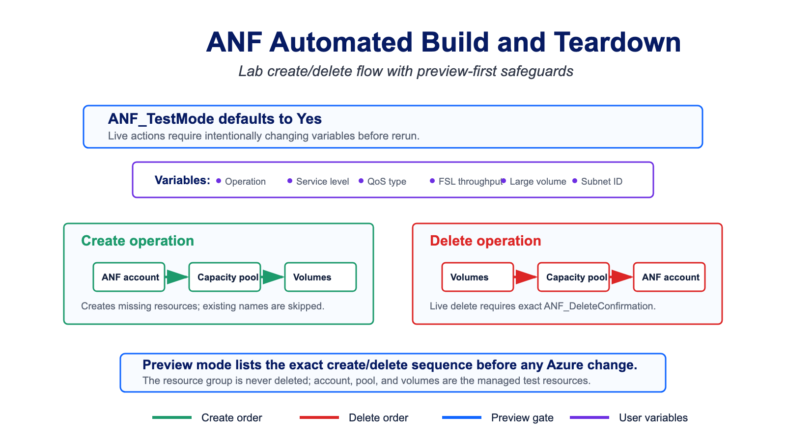

# ANF Automated Build and Teardown

This lab helper creates or deletes an Azure NetApp Files account, one capacity pool, and sequentially named volumes. It supports Standard, Premium, Ultra, and Flexible Service Level capacity pools.



## Safety Defaults

- `ANF_TestMode` defaults to `Yes`, so create and delete actions are previewed only.
- Live delete requires `ANF_TestMode=No` and an exact `ANF_DeleteConfirmation` value.
- The script is non-interactive. All decisions are supplied as variables so the planned action is visible before the run starts.
- The resource group must already exist. Delete mode attempts to delete it by default, but only if the group is empty after ANF teardown. If other resources remain, the script warns and leaves the resource group intact.
- Delete mode removes volumes, then the capacity pool, then the ANF account, and waits for Azure to confirm each layer is gone before moving to the next layer.

## Inputs

Set these as environment variables before running from Cloud Shell or a local PowerShell session. Azure Automation variables with the same names are also supported, although this script is primarily intended for lab/manual use.

| Variable | Default | Impact |
| --- | --- | --- |
| `ANF_Operation` | `Create` | `Create` creates or verifies the account, pool, and volumes. `Delete` removes volumes, then pool, then account. |
| `ANF_TestMode` | `Yes` | `Yes` previews actions only. Set to `No` for live create/delete. |
| `ANF_DeleteConfirmation` | empty | Required only for live delete. Must exactly equal `DELETE <account>/<pool>`. |
| `ANF_DeleteResourceGroupIfEmpty` | `Yes` | Deletes the resource group only if it is empty after the ANF account is gone. If other resources remain, the script warns and leaves the resource group intact. Set to `No` to always leave the resource group. |
| `ANF_TenantId` | current context | Optional tenant ID for authentication. |
| `ANF_SubscriptionId` | current context | Optional subscription ID. |
| `ANF_ResourceGroupName` | required | Existing resource group that contains or will contain the ANF account. |
| `ANF_AccountName` | required | ANF account name. |
| `ANF_PoolName` | required | Capacity pool name. |
| `ANF_Location` | required | Azure region name, for example `westus2`. |
| `ANF_ServiceLevel` | `Standard` | `Standard`, `Premium`, `Ultra`, or `Flexible`. |
| `ANF_QosType` | `Auto` | `Auto` or `Manual` for classic service levels. Flexible is always treated as Manual. |
| `ANF_PoolSizeTiB` | `1` | Capacity pool size in TiB. |
| `ANF_FslPoolThroughputMibps` | `128` | Flexible Service Level pool throughput in MiB/s. |
| `ANF_VolumePrefix` | `Vol` | Prefix for sequential volume names. |
| `ANF_VolumeCount` | `3` | Number of volumes to create. |
| `ANF_VolumeSizeGiB` | `60` | Size of each volume in GiB. Regular volumes require at least 50 GiB. |
| `ANF_VolumeThroughputMibps` | `1` | Per-volume throughput for Manual QoS and Flexible pools. |
| `ANF_DelegatedSubnetId` | required for create | Delegated subnet Resource ID for volume creation. |
| `ANF_NetworkFeatures` | `Standard` | Volume network features value. |
| `ANF_ProtocolTypes` | `NFSv3` | One or more protocol types separated by commas, semicolons, or new lines. |
| `ANF_IsLargeVolume` | `No` | Set to `Yes` to create large volumes. |
| `ANF_LargeVolumeMaximumSizeGiB` | `1048576` | Large-volume maximum guardrail. Default is 1 PiB. |
| `ANF_WaitSleepSeconds` | `30` | Polling interval for create/delete completion checks. |
| `ANF_WaitMaxSeconds` | `3600` | Maximum wait time for each long-running resource operation. |

## Create Example

Cloud Shell PowerShell copy/paste example. Replace the values in the first block, paste the whole block into a new Cloud Shell session, and it will download the current script from GitHub before running in test mode.

```powershell
$workDir = Join-Path $HOME "anf-auto-build-teardown"
$scriptUri = "https://raw.githubusercontent.com/tvanroo/public-anf-toolbox/main/Automated%20Build%20and%20Teardown/ANF-Auto-Build-Teardown.ps1"
$scriptPath = Join-Path $workDir "ANF-Auto-Build-Teardown.ps1"

New-Item -ItemType Directory -Path $workDir -Force | Out-Null
Invoke-WebRequest -Uri $scriptUri -OutFile $scriptPath

$env:ANF_Operation = "Create"
$env:ANF_TestMode = "Yes"
$env:ANF_ResourceGroupName = "<resource-group>"
$env:ANF_AccountName = "<anf-account>"
$env:ANF_PoolName = "<capacity-pool>"
$env:ANF_Location = "westus2"
$env:ANF_ServiceLevel = "Premium"
$env:ANF_PoolSizeTiB = "2"
$env:ANF_VolumeCount = "3"
$env:ANF_VolumeSizeGiB = "100"
$env:ANF_DelegatedSubnetId = "/subscriptions/<sub>/resourceGroups/<rg>/providers/Microsoft.Network/virtualNetworks/<vnet>/subnets/<subnet>"

pwsh -NoProfile -File $scriptPath
```

Review the preview output, then set `ANF_TestMode` to `No` for the live create run.

## Flexible Service Level Example

```powershell
$env:ANF_ServiceLevel = "Flexible"
$env:ANF_QosType = "Manual"
$env:ANF_FslPoolThroughputMibps = "128"
$env:ANF_VolumeThroughputMibps = "10"
```

Flexible Service Level capacity and throughput are independent. The script sets pool throughput with `ANF_FslPoolThroughputMibps` and volume throughput with `ANF_VolumeThroughputMibps`.

## Delete Example

Preview delete:

```powershell
$workDir = Join-Path $HOME "anf-auto-build-teardown"
$scriptUri = "https://raw.githubusercontent.com/tvanroo/public-anf-toolbox/main/Automated%20Build%20and%20Teardown/ANF-Auto-Build-Teardown.ps1"
$scriptPath = Join-Path $workDir "ANF-Auto-Build-Teardown.ps1"

New-Item -ItemType Directory -Path $workDir -Force | Out-Null
Invoke-WebRequest -Uri $scriptUri -OutFile $scriptPath

$env:ANF_Operation = "Delete"
$env:ANF_TestMode = "Yes"
$env:ANF_ResourceGroupName = "<resource-group>"
$env:ANF_AccountName = "<anf-account>"
$env:ANF_PoolName = "<capacity-pool>"
$env:ANF_Location = "westus2"

pwsh -NoProfile -File $scriptPath
```

Live delete:

```powershell
$workDir = Join-Path $HOME "anf-auto-build-teardown"
$scriptUri = "https://raw.githubusercontent.com/tvanroo/public-anf-toolbox/main/Automated%20Build%20and%20Teardown/ANF-Auto-Build-Teardown.ps1"
$scriptPath = Join-Path $workDir "ANF-Auto-Build-Teardown.ps1"

New-Item -ItemType Directory -Path $workDir -Force | Out-Null
Invoke-WebRequest -Uri $scriptUri -OutFile $scriptPath

$env:ANF_Operation = "Delete"
$env:ANF_TestMode = "No"
$env:ANF_ResourceGroupName = "<resource-group>"
$env:ANF_AccountName = "<anf-account>"
$env:ANF_PoolName = "<capacity-pool>"
$env:ANF_Location = "westus2"
$env:ANF_DeleteConfirmation = "DELETE <account>/<pool>"
# Default: delete the resource group only if no resources remain after teardown.
# Set to "No" to always leave the resource group.
$env:ANF_DeleteResourceGroupIfEmpty = "Yes"

pwsh -NoProfile -File $scriptPath
```

The delete path removes volumes first, waits until the pool's volume list is empty, removes the capacity pool, waits until the account no longer lists that pool, and only then removes the ANF account. If any capacity pool still remains in the account, the script stops instead of attempting the account delete.

If Azure reports `CannotDeleteResource` because a nested volume still exists during capacity pool deletion, the script refreshes the pool volume list, deletes any remaining nested volumes reported by Azure, waits again, and retries the capacity pool deletion.

Resource group deletion is enabled by default but still guarded. When `ANF_DeleteResourceGroupIfEmpty=Yes`, the script lists resources in the resource group after ANF account deletion. If any resource remains, it writes a warning with the remaining resource names and leaves the resource group in place. Set `ANF_DeleteResourceGroupIfEmpty=No` to skip the resource group delete check entirely.

## Notes

- Existing accounts, pools, and matching volume names are skipped during create rather than overwritten.
- The script uses ARM REST calls and only requires `Az.Accounts`.
- Use this for disposable test resources only. It is intentionally explicit about delete confirmation because the account and pool are removed in live delete mode.
